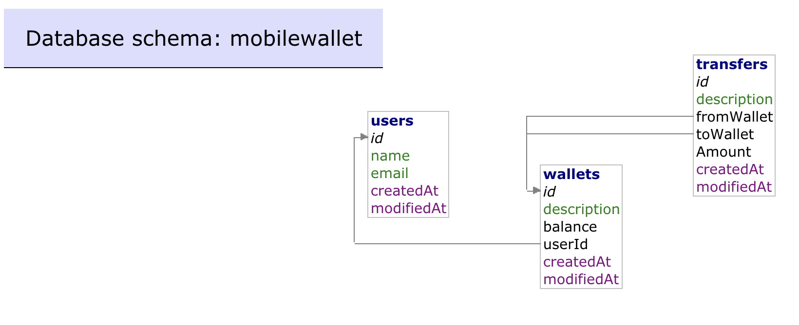

# go-mobilewallet-api

API written with go mysql and mux

## Run
Application can be run using the `docker-compose`.
```
docker-compose up
```
This will boot up 3 services, 1 API service, MySQL and adminer to run DB migration scripts.

```
- copy sql from src/files/db/create_table.sql
- visit http://localhost:8080/?server=db&username=root&sql=
- paste and run the SQL
```
This will create 3 users and attach 1 wallet to each account.

## DB design


## Auth
A simple token based authentication is used for this PoC, where it's assumed that user will procure the right token using 
another API and pass this to all the mobile wallet apis.
Alternatively, the middleware can be extended to use JWT based authentication (which is recommended approach for production).
There are 3 user tokens hardcoded in the application that can be used in the curl request by providing `X-Session-Token`
or in swagger as a header param, values are following:
```
11111111
22222222
33333333
```
